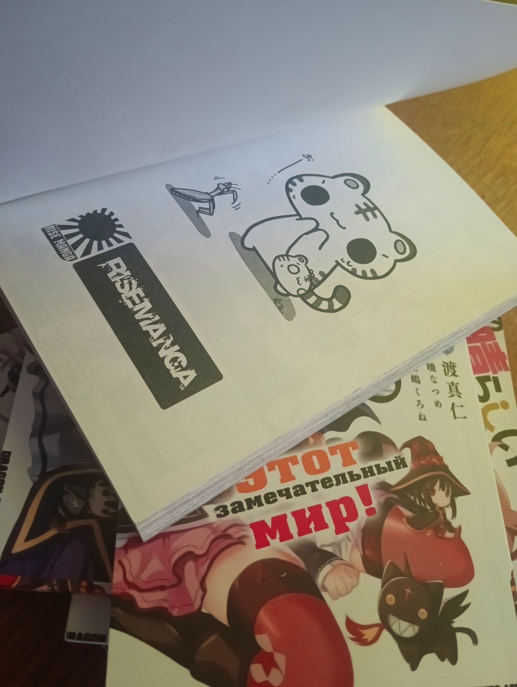

# Оптимізація зображень за допомогою Squoosh

##     1. Аналіз вихідних файлів
        
|       |Вхідні дані|Формат|Розмір|Вага|
|-------|-----------|------|----|------|
|Фото||JPG|3072x4080|2.3 mb
|Скріншот||PNG|1920x1080|510 kb
|Графічне зображення з текстом||JPG|1920x1080|375 kb

    
    
##    2. Стиснення без втрати якості(lossless)

### **Фото**
    
|JPG|Browser PNG|WebP|
|---|-----------|----|
| |||
|2.3 mb|10.7 mb|4.93 mb

### **Скріншот**
    
|PNG|Browser PNG|WebP|
|---|-----------|----|
| |||
|510 kb|7 mb|275 kb|

### **Графічне зображення з текстом**
    
|JPG|Browser PNG|WebP|
|---|-----------|----|
||||
|375 kb|3 mb|1.33 mb|

##     3. Стиснення з втратою якості (lossy)

### **Фото**

|JPG|MozJPEG|WebP(lossy)|AVIF|
|---|-----------|-------|----|
| |||
|3072x4080|3072x4080|1536x2040|1536x2040

### **Скріншот**
    
|JPG|MozJPEG|WebP(lossy)|AVIF|
|---|-----------|-------|----|
| |||
|1920x1080|1920x1080|1020x630|960x518|

### **Графічне зображення з текстом**
    
|JPG|MozJPEG|WebP(lossy)|AVIF|
|---|-----------|-------|----|
||||
|1920x1080|1920x1080|960x540|960x540

### Висновок: При значенні Quality ~= 20 рівень якості зображення залишается прийнятним

##     4. Оптимізація розміру відповідно до цільового використання

|Для вебу|Для мобільних пристроїв|Для Retina-дисплеїв|
|--------|-----------------------|-------------------|
||||
|90 kb|35.2 kb|2.35 mb|
||||
|73.8 kb|20.8 kb|345 kb|
||||
|141 kb|47.8 kb|652 kb|
